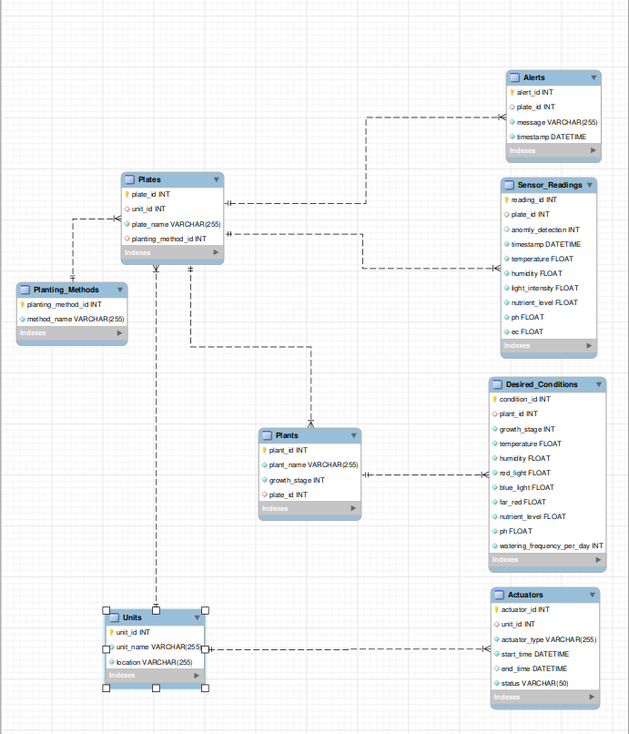

# family_farmDB

## Prerequisites

Before you can use this database, ensure you have the following:

- **MySQL** installed (preferably MySQL 8.0 or above).
- **MySQL Workbench** installed for easier model visualization and management (optional but recommended).

## Database Setup

### 1. Clone the Repository

If you haven’t already cloned the repository, run the following command:

```bash
git clone https://github.com/zaynabahmad/family_farmDB.git
cd family_farmDB
```

### 2. database import

```bash
mysql -u root -p FamilyFarmDB < family_farmdb.sql
```

* Replace root with your MySQL username if it's different.
* Enter your MySQL password when prompted.

### 3. to show the DataBase

```sql
SHOW TABLES;
```

#### 4. adding data example

```sql
INSERT INTO Sensor_Reading_Fact (
    Sensor_Reading_ID, Sensor_ID, Reading_Value, Timestamp, Sensor_Type,
    Anomaly_Label, Alarm_Level, Condition_ID, Plant_ID, Unit_ID
) VALUES (
    1, 101, 23.5, '2024-11-23 12:00:00', 'Temperature', FALSE, 'Low', 2, 10, 3
);
```

### 5. some querying examples

```sql
SELECT * FROM Sensor_Reading_Fact WHERE Timestamp BETWEEN '2024-11-01' AND '2024-11-23';
```

### new data base

#### the query : new_db.sql

#### insert

*run the query insert_data.sql*



### Multi-Tenant Architecture

**Multi-Tenant Architecture** refers to a software architecture where a single instance of a software application serves multiple clients (tenants). Each tenant operates in a shared environment, yet has isolated data and configurations, ensuring privacy and security while utilizing common resources.

In this architecture, tenants can be individual users, groups, or organizations that access the same application, but their data, preferences, and settings remain separate from one another. This allows for efficient resource utilization while maintaining the customization and isolation that each tenant requires.

#### Key Components of Multi-Tenant Architecture:

1. **Tenants** :

* A **tenant** represents a distinct user group or client within the system. Each tenant may include one or more users who share access to the application and its features.
* Tenants can represent different organizations, teams, or individual clients, each with their own data and configuration settings.

1. **Data Isolation** :

* A core principle of multi-tenancy is the isolation of tenant data. Despite using the same application infrastructure, each tenant's data is kept private and secure, ensuring that one tenant cannot access or manipulate the data of another.
* Data isolation is achieved through various architectural strategies such as using unique identifiers for each tenant or physically separating the data in different databases or tables.

1. **Shared Resources** :

* While each tenant's data is isolated, the underlying resources, such as servers, database engines, and application services, are shared among all tenants. This maximizes the efficiency of resource utilization and reduces operational costs.

1. **Customizability** :

* Tenants are typically allowed to customize certain features and settings within the shared environment. This can include preferences such as UI themes, branding, and specific configurations relevant to the tenant's use case.
